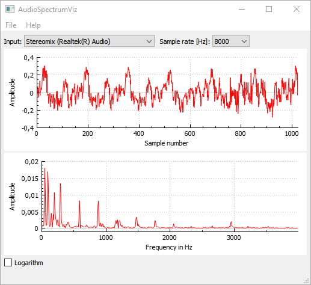

# AudioSpectrumViz
AudioSpectrumViz is a simple application for real-time vizualization of waveform and spectrum of microphone input

  

A precompiled package for Windows (64bit) can be downloaded from:
[GitHub release section](https://github.com/spectralcode/AudioSpectrumViz/releases).
